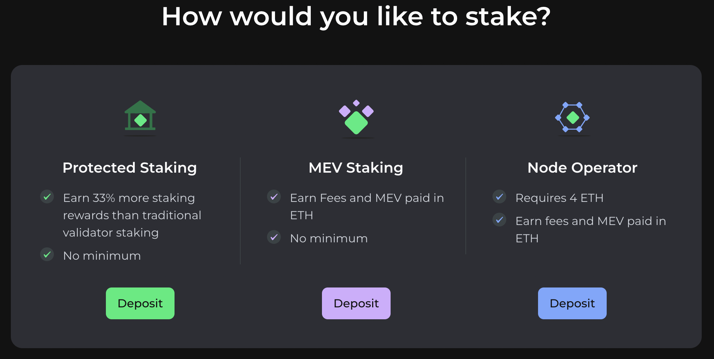
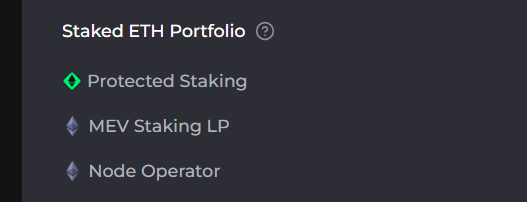

# LSD Dapp



## Overview

LSD Dapp allows you to interact with the Liquid Staking Derivative Network Protocol smart contracts built on top of the Stakehouse protocol.

For more information, please take a look at the docs: https://docs-ipfs.joinstakehouse.com/lsd/overview

## Software is provided as is

Please feel free to customize and host as best suits. This Dapp can easily serve as a whitelabelling site and method to attract ETH stake to a specific Stakehouse rather than supporting every LSD network. There is a lot of freedom.

## Netlify Supported

Any hosting site should work but this dapp has been working on Netlify. If there are any issues hosting on other services, please open a PR by following the contribution guide below.

## Getting Started

### `npm i`

Installs the dependencies.

### `npm start`

Runs the app in the development mode.\
Open [http://localhost:3000](http://localhost:3000) to view it in the browser.

The page will reload if you make edits.\
You will also see any lint errors in the console.

### `npm run build`

Builds the app for production to the `build` folder.\
It correctly bundles React in production mode and optimizes the build for the best performance.

The build is minified and the filenames include the hashes.\
Your app is ready to be deployed!

See the section about [deployment](https://facebook.github.io/create-react-app/docs/deployment) for more information.

## Enabling the user portfolio (Stakehouse ETL)

The LSD dapp has a user portfolio feature which allows liquidity providers for LSD networks to be able to trace, down to the validator where the ETH in an LSD pool goes. In the open source code, this feature (located in the `Manage` section of the dapp) is not enabled by default. The feature is not enabled by default because it requires the availability of the [Stakehouse ETL](https://github.com/stakehouse-dev/stakehouse-etl) infrastructure. Assuming that the Stakehouse ETL is available, fully synced and operation, this feature can be enabled:



To do this, the following file needs to be modified:

```
src/components/app/Manage/Positions.tsx
```

In the `Positions.tsx`, the following object can be found:

```
const position = {
  label: 'Staked ETH Portfolio',
  subPositions: [
    {
      label: 'Protected Staking',
      ref: 'stakedStakingAmount',
      mode: WITHDRAW_MODE.STAKING,
      icon: <DEthIcon />
      //href: '/manage/protected-staking'
    },
    {
      label: 'MEV Staking LP',
      ref: 'stakedFeesAmount',
      mode: WITHDRAW_MODE.FEES_MEV
      //href: '/manage/fees-mev'
    },
    {
      label: 'Node Operator',
      ref: 'stakedNodeAmount',
      mode: WITHDRAW_MODE.NODE_OPERATOR
      //href: '/manage/node-operator'
    }
  ]
}
```

Removing the comments on the `href` will enable the portfolios. In addition, the following DOM item needs updating:

```
<StatSubItem
              key={index}
              label={subItem.label}
              icon={subItem.icon}
              //href={subItem.href}
              amount={amountData[subItem.ref]}
            />
```

Finally, the ETL configuration (URLs) need to be injected. In order to do that, the following file needs to be updated:

```
src/constants/index.ts
```

where the endpoint that needs updating is called `API_ENDPOINT`.

In order to run your own ETL instance, please find the following AWS deployable code:
```
https://github.com/stakehouse-dev/stakehouse-etl
```

## Contributing

We welcome contributions to LSD Dapp. If you'd like to contribute, please follow these guidelines:

1. Fork the project.
2. Create a new branch for your feature or bug fix.
3. Make your changes and commit them with clear and concise messages.
4. Push your changes to your fork.
5. Create a pull request to the main repository.

## Limit deposits to your LSD network

If you wish to deploy and use the Dapp and allow node operators to register only with your selected LSD networks, please follow these guidelines:

1. Fork the project.
2. Open `src/graphql/queries/LSDNetworks.ts`.
3. Replace `liquidStakingNetworks(first: 1000)` on line 41 with `liquidStakingNetworks(where:{ticker_in:[<LIST_OF_TICKERS>]})`.

## License

This project is licensed under MIT - see the [LICENSE.md](./LICENSE.md) file for details.
